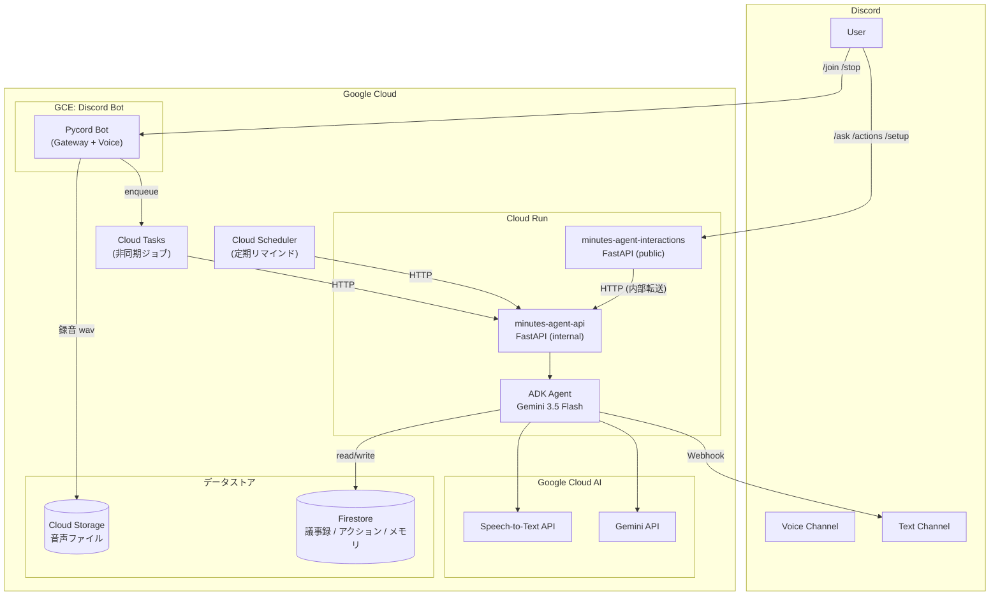
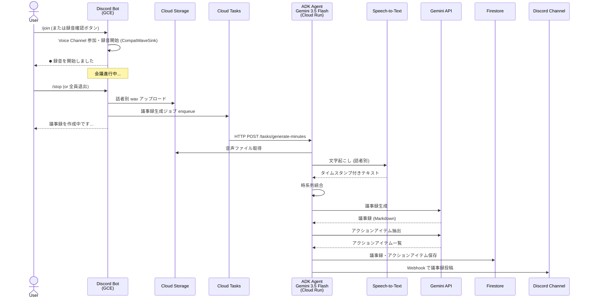
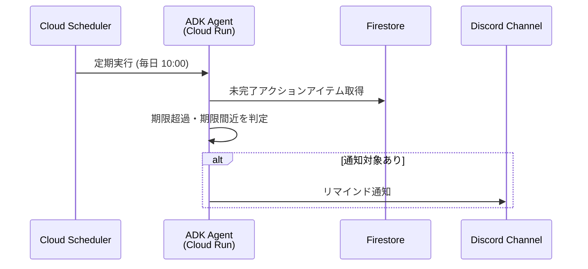
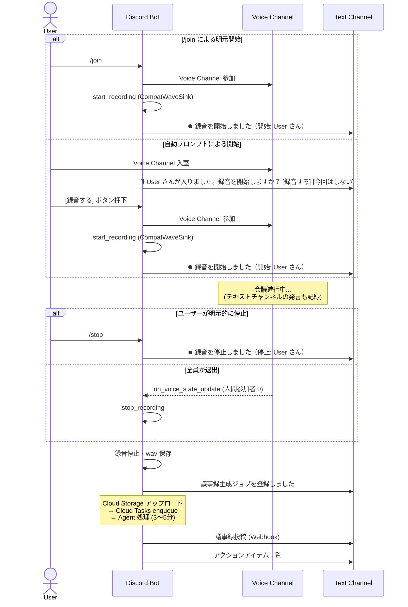
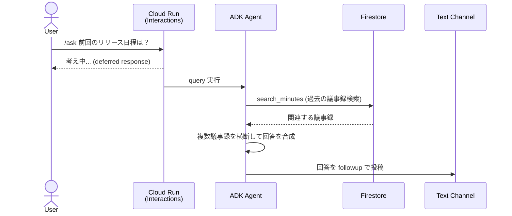
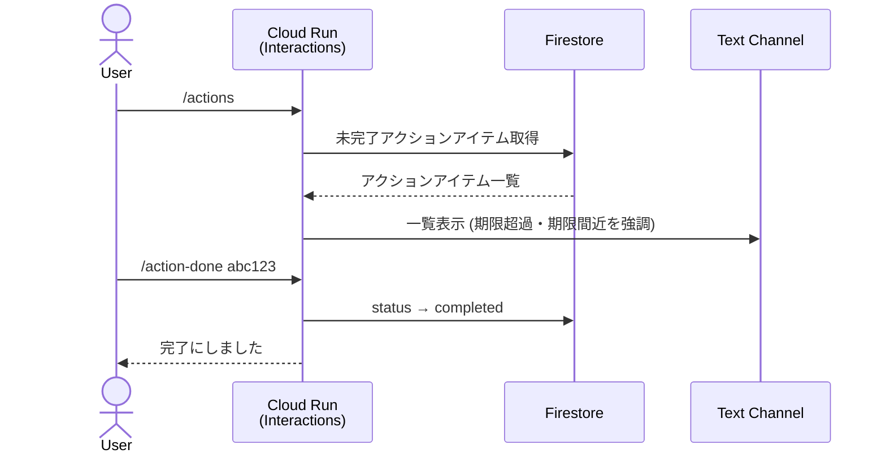
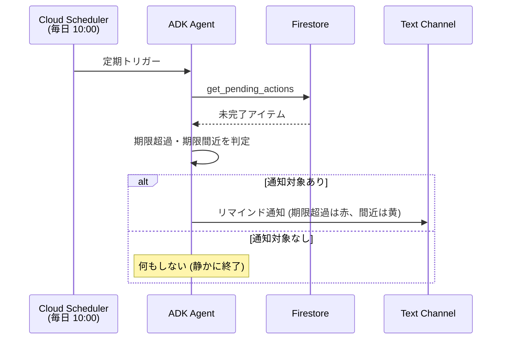

# Minutes Agent — Design Document

## 1. Overview

Discord の定例ミーティングの **会議アカウンタビリティ（説明責任・実行責任）** を自律的に管理する AI エージェント。

Bot が自ら voice channel に参加して録音し、文字起こし→議事録生成→アクションアイテム抽出→Discord 投稿までを全自動で行う。さらに、会議と会議の間（between-meetings）でアクションアイテムの追跡・リマインド・過去議事録の横断検索を自律的に実行する。

**ハッカソン**: [DevOps × AI Agent Hackathon](https://findy.co.jp/4127/) (Findy × Google Cloud)
**提出期限**: 2026-07-12（当初 7/10 から延長。運営アナウンス 2026-07-08）

## 2. Problem Statement

### 表面的な課題: 議事録作成の手間

小規模チームの週次 Discord ミーティングで、議事録作成に毎回 15〜20 分かかる。録音→文字起こし→整形→共有のフローが手動。

### 本質的な課題: 会議のアカウンタビリティ

議事録が作成されても、**決めたことが実行されない**。

- 「前回何を決めたか」が曖昧なまま次の会議が始まる
- アクションアイテムの担当者・期限が形骸化する
- 同じ議題が何度も蒸し返され、結論が出ない
- テキスト参加者の発言が議事録から漏れる

**Minutes Agent はこの「決めたことが実行されない」問題を、AI エージェントの自律的な追跡・通知で解決する。**

### 既存アプローチの限界

Phase 1 として、Craig (録音 Bot) + Whisper (ローカル文字起こし) + Claude Code CLI (議事録生成) のパイプラインを構築し、コマンド 1 発で議事録を生成できるようにした（[Zenn 記事](https://zenn.dev/hinapupil/articles/discord-whisper-meeting-minutes)）。

しかし以下の限界がある:

- Craig の zip を**手動でダウンロード**する必要がある
- ローカル GPU (RTX 3060 等) が必要で**環境依存**
- 議事録生成は 1 回のパイプライン実行で完結し、**文脈の蓄積がない**
- アクションアイテムの追跡・リマインドは**人間任せ**

## 3. Target Users

- **小規模チーム (3〜10 人)** で Discord ミーティングをしている
- 週次〜隔週の定例会議がある
- 議事録は作りたいが、作成・管理のコストを下げたい
- 特別なツール導入なく、Discord だけで完結させたい

## 4. Architecture

### システム全体



### 議事録生成フロー



### Between-Meetings 自律動作



### なぜこの構成か

| 決定 | 理由 |
|------|------|
| GCE で Bot | Voice channel 参加に UDP が必要。Cloud Run は TCP/HTTP のみ |
| Cloud Run で Agent API (2サービス) | AI 処理はリクエスト駆動。route profile で内部/公開を分離し、interactions は Discord Interactions Endpoint を公開、api は Cloud Tasks/Scheduler 専用。提出要件の「デプロイ済み URL」にもなる |
| Cloud Tasks で中継 | 議事録生成は数分かかる。Bot → Agent の受け渡しを非同期化し、リトライも任せられる |
| Firestore | ADK の Session/Memory 統合がビルトイン。議事録・アクションアイテムも同一 DB で管理 |
| Cloud Scheduler | between-meetings のリマインド通知。エージェントの「自律的な行動」の起点 |

## 5. Components

### 5.1 Discord Bot (GCE)

**技術**: Pycord v2.8 (`py-cord[voice]`)、upstream PR #3159 ブランチを SHA 固定でインストール

Pycord を選定した理由:
- `start_recording()` → `WaveSink` で話者ごとに自動分離（Craig 相当の機能が数行で実現）
- ADK と同じ Python で言語統一
- Production/Stable、アクティブメンテナンス

**DAVE (Discord Audio Video Encryption) 対応**:
Discord は 2025 年後半以降 E2EE (DAVE プロトコル) を全ギルドで強制しており、非 E2EE ダウングレード (`protocol_versions=[]`) は 4017 エラーで拒否される。受信側 DAVE 復号を実装した upstream PR #3159 ブランチを SHA 固定でインストールし (`pyproject.toml` 参照)、`CompatWaveSink` シム (`bot/commands/recording.py`) で新受信パイプラインにレガシー WaveSink を適合させている。

**責務**:
- Discord Gateway 接続の維持
- Voice channel 参加・録音・退出
- `/join` `/stop` Slash Command の処理
- 録音完了時に Cloud Storage アップロード → Cloud Tasks enqueue

**Voice Recording の実装**:

`CompatWaveSink` は pycord 2.8 の新受信パイプラインがレガシー WaveSink に要求する契約（`__sink_listeners__` / `walk_children()` / `is_opus()` / VoiceData 対応 `write()`）を補うシムレイヤー。バージョン更新時に契約が変わった場合は `tests/test_pycord_sink_contract.py` の AST 契約テスト（py-cord のソースから `sink.X` の属性アクセスを列挙し、CompatWaveSink が全て満たすことを検証）が CI で検出する。

```python
# bot/commands/recording.py (要約)
class CompatWaveSink(discord.sinks.WaveSink):
    """2.8 の新受信パイプラインでレガシー WaveSink を動かす互換層。"""
    __sink_listeners__: list[tuple[str, str]] = []

    def is_opus(self) -> bool:
        return False  # PCM 前提

    def walk_children(self, *, with_self: bool = False):
        if with_self:
            yield self

    def write(self, data, user=None) -> None:
        pcm = getattr(data, "pcm", None) or (data if isinstance(data, (bytes, bytearray)) else b"")
        # user_id 解決 → audio_data[user_id] に PCM 書き込み
        ...
```

録音開始時は `voice_client.start_recording(CompatWaveSink(), finished_callback, None)` で開始し、停止後にローカル保存 → GCS アップロード → Cloud Tasks enqueue の順で処理する。

### 5.2 Agent API (Cloud Run)

**技術**: FastAPI + ADK

Cloud Run 上で動く HTTP API。Bot からの非同期ジョブ受信と、Discord Interactions (対話コマンド) の両方を処理する。

**エンドポイント**:

Cloud Run サービスは2つに分離しており、`MINUTES_AGENT_ROUTE_PROFILE` 環境変数でルートの公開範囲を制御する。`minutes-agent-api` (profile=internal) は Cloud Tasks/Scheduler からの内部呼び出し専用、`minutes-agent-interactions` (profile=public) は Discord Interactions Endpoint を公開する。

| Method | Path | サービス | 用途 |
|--------|------|----------|------|
| POST | `/tasks/generate-minutes` | api (internal) | 議事録生成（Cloud Tasks から） |
| POST | `/tasks/check-actions` | api (internal) | アクションアイテム期限チェック（Cloud Scheduler から） |
| POST | `/commands/ask` | api (internal) | /ask の実処理（interactions から内部転送） |
| POST | `/commands/actions` | api (internal) | /actions の実処理 |
| POST | `/commands/action-done` | api (internal) | /action-done の実処理 |
| POST | `/interactions` | interactions (public) | Discord Interactions Endpoint |
| GET | `/health` | 両方 | ヘルスチェック |
| GET | `/` | interactions (public) | ランディングページ（審査用） |

**なぜ Interactions Endpoint も併用するか**:
- `/ask` `/actions` は voice 不要 → Cloud Run で直接応答可能
- GCE Bot が落ちていても対話コマンドは動く（可用性向上）
- 「デプロイ済み URL」として審査で動作確認可能

**Discord アプリは2つに分離する**（[ADR-0002](adr/0002-split-discord-apps-for-gateway-and-interactions.md)）:

Discord の仕様上、Interactions Endpoint URL を設定したアプリは全コマンドが HTTP に送られ Gateway に届かなくなるため、単一アプリでの併用は不可能。以下の2アプリ構成とする。

| アプリ | 責務 | コマンド |
|--------|------|----------|
| 録音 Bot 用（`minutes-bot`） | GCE で Gateway 接続・voice 録音。Endpoint URL は設定しない | `/join` `/stop` |
| Interactions 用（`minutes-interactions`） | Cloud Run `/interactions` で HTTP 応答。Gateway 接続なし | `/minutes` `/ask` `/actions` `/action-done` `/setup` |

**用語集の蒸留と注入 (/setup)**:

`/setup repo:owner/name` を実行すると、指定された public GitHub リポジトリから README・ドキュメント・コントリビューター・ファイルツリーを取得し、Gemini でプロジェクト固有の用語集（固有名詞・人名・技術用語）を蒸留する (`minutes_agent/github_glossary.py`)。結果は `guild_settings/{guild_id}` に保存され、以後の議事録生成時に音声認識の誤変換補正コンテキストとして注入される。

### 5.3 ADK Agent

Agent 定義は `agent/agent.py`、Runner 構築は `agent/runtime.py` に分離している。

```python
# agent/agent.py
from google.adk import Agent
from google.adk.tools.load_memory_tool import load_memory

def build_root_agent(settings):
    return Agent(
        model=settings.gemini_model,  # default: "gemini-3.5-flash"
        name="minutes_agent",
        instruction=AGENT_INSTRUCTION,
        tools=[
            transcribe_audio,
            generate_minutes,
            extract_action_items,
            search_minutes,
            get_pending_actions,
            send_discord_message,
            load_memory,
        ],
    )
```

```python
# agent/runtime.py
from google.adk.runners import Runner
from google.adk.integrations.firestore.firestore_session_service import FirestoreSessionService
from google.adk.integrations.firestore.firestore_memory_service import FirestoreMemoryService

def build_runner(settings):
    client = firestore.AsyncClient(project=settings.google_cloud_project)
    session_service = FirestoreSessionService(client=client, root_collection="adk-session")
    memory_service = FirestoreMemoryService(client=client, ...)
    return Runner(
        app_name="minutes-agent",
        agent=build_root_agent(settings),
        session_service=session_service,
        memory_service=memory_service,
        auto_create_session=True,
    )
```

`/ask` コマンドは `AdkQuestionAnswerer` (`agent/runtime.py`) 経由で Runner を実行し、ADK がツールを自律選択して回答を生成する。議事録生成は `MinutesWorkflow` (`minutes_agent/workflow.py`) が各ツール（Speech-to-Text → Gemini 議事録生成 → アクションアイテム抽出）を直接オーケストレーションする。

### 5.4 Tools

| ツール | 使用 API | 入力 | 出力 |
|--------|----------|------|------|
| `transcribe_audio` | Speech-to-Text API | GCS URI, 話者名 | タイムスタンプ付きテキスト |
| `generate_minutes` | Gemini API | トランスクリプト, 日付, コンテキスト | 議事録 (Markdown) |
| `extract_action_items` | Gemini API | 議事録テキスト | アクションアイテムのリスト |
| `search_minutes` | Firestore | 検索クエリ | 関連する過去の議事録 |
| `get_pending_actions` | Firestore | なし | 未完了アクションアイテム一覧 |
| `send_discord_message` | Discord Webhook | チャンネル ID, コンテンツ | 送信結果 |

### 5.5 Data Store (Firestore)

```
minutes-agent (database)
├── meetings/
│   └── {meeting_id}/
│       ├── meeting_id: string
│       ├── guild_id: string
│       ├── channel_id: string
│       ├── participants: [{user_id, display_name}]
│       ├── audio_files: [{speaker_id, speaker_name, gcs_uri, content_type}]
│       ├── text_messages: [{message_id, author_id, author_name, content, created_at}]
│       ├── transcript_segments: [{speaker_id, speaker_name, text, start_seconds, end_seconds}]
│       ├── transcript: string | null
│       ├── minutes_md: string | null
│       ├── status: "recording" | "transcribing" | "generating" | "completed" | "error"
│       ├── error: string | null
│       ├── created_at: timestamp
│       └── updated_at: timestamp
│
├── action_items/
│   └── {action_id}/
│       ├── action_id: string
│       ├── meeting_id: string
│       ├── title: string
│       ├── description: string
│       ├── assignee: string | null        # Discord username
│       ├── assignee_id: string | null     # Discord user ID
│       ├── due_date: timestamp | null
│       ├── status: "open" | "in_progress" | "completed"
│       ├── source_quote: string | null
│       ├── created_at: timestamp
│       └── completed_at: timestamp | null
│
├── guild_settings/
│   └── {guild_id}/
│       ├── repo: string               # "owner/name" 形式
│       ├── glossary: [string]          # 蒸留済み用語リスト
│       └── glossary_updated_at: timestamp
│
├── adk-session/                        # ADK SessionService (自動管理)
│   └── ...
│
├── events/                             # ADK MemoryService (自動管理)
│   └── ...
│
└── memories/                           # ADK MemoryService (自動管理)
    └── ...
```

## 6. User Flows

### 6.1 Recording & Minutes Generation (全自動)

録音開始には2つの経路がある:

1. **`/join` コマンド**: 即座に録音を開始する（明示的な意思表示）
2. **自動プロンプト**: ユーザーが voice channel に入室すると `RecordingPromptView`（「録音する」「今回はしない」ボタン）を text channel に送信し、確認後に開始する。クールダウン 5 分、タイムアウト 10 分

どちらの経路でも録音開始・停止はチャンネル全員に公開通知される（録音の透明性・同意のため）。



### 6.2 Ask (対話検索)



### 6.3 Action Items



### 6.4 Between-Meetings: 自律リマインド



## 7. Slash Commands

| コマンド | 引数 | 処理場所 | 説明 |
|----------|------|----------|------|
| `/join` | なし | GCE Bot | voice channel に参加し録音開始 |
| `/stop` | なし | GCE Bot | 録音停止、議事録生成を開始 |
| `/minutes` | `file: Attachment` | Cloud Run | zip/音声ファイルから議事録生成（手動フォールバック） |
| `/ask` | `question: string` | Cloud Run | 過去の議事録に関する質問 |
| `/actions` | `status?: string` | Cloud Run | アクションアイテム一覧 |
| `/action-done` | `id: string` | Cloud Run | アクションアイテムを完了にする |
| `/setup` | `repo: string` | Cloud Run | GitHub リポジトリ（owner/repo）から用語集を蒸留して学習。議事録生成時の固有名詞補正に使う（ADR-0003） |

## 8. Tech Stack

| カテゴリ | 技術 | 用途 |
|----------|------|------|
| **AI / ML** | Gemini 3.5 Flash | 議事録生成、アクションアイテム抽出、対話応答 |
| | Speech-to-Text API (V2) | 音声の文字起こし（話者分離対応） |
| | ADK (Agent Development Kit) | エージェントオーケストレーション |
| **Compute** | Cloud Run | Agent API (サーバーレス) |
| | GCE (e2-small) | Discord Bot (常時起動) |
| **Data** | Firestore | 議事録、アクションアイテム、ADK セッション/メモリ |
| | Cloud Storage | 音声ファイル保管 |
| **Async** | Cloud Tasks | 非同期ジョブキュー |
| | Cloud Scheduler | 定期実行（リマインド通知） |
| **Discord** | Pycord v2.8 (PR #3159 SHA 固定) | Bot フレームワーク (DAVE E2EE + voice recording) |
| **Web** | FastAPI | Agent API サーバー |
| **IaC** | Terraform | GCP リソース管理 |
| **CI/CD** | GitHub Actions | ビルド、テスト、Cloud Run デプロイ |
| **Language** | Python 3.12 | 全コンポーネント統一 |

## 9. Project Structure

```
minutes-agent/
├── agent/                        # ADK Agent
│   ├── __init__.py
│   ├── agent.py                  # root_agent 定義 (build_root_agent)
│   ├── runtime.py                # Runner 構築、AdkQuestionAnswerer
│   └── tools/
│       ├── __init__.py           # ツール関数の公開インターフェース
│       ├── transcribe.py         # Speech-to-Text V2 (batch_recognize)
│       ├── minutes.py            # 議事録生成 (Gemini)
│       ├── actions.py            # アクションアイテム抽出 (Gemini)
│       ├── search.py             # Firestore 検索 (search_minutes, get_pending_actions)
│       └── discord_notify.py     # Discord Webhook 通知
├── bot/                          # Discord Bot (GCE)
│   ├── __init__.py
│   ├── main.py                   # Bot 起動、Cog 登録
│   └── commands/
│       ├── __init__.py
│       └── recording.py          # /join, /stop, CompatWaveSink, RecordingPromptView
├── api/                          # Cloud Run API
│   ├── __init__.py
│   ├── main.py                   # FastAPI app、ルートプロファイル制御
│   ├── tasks.py                  # /commands/* リクエストモデル
│   ├── interactions.py           # Discord Interactions Endpoint ハンドラ
│   └── landing.py                # ランディングページ HTML
├── minutes_agent/                # 共有ライブラリ
│   ├── __init__.py
│   ├── config.py                 # Settings (環境変数 → dataclass)
│   ├── models.py                 # MeetingRecord, ActionItem, etc.
│   ├── firestore.py              # FirestoreRepository (CRUD)
│   ├── storage.py                # GcsStorage (音声アップロード)
│   ├── tasks.py                  # CloudTasksPublisher (enqueue)
│   ├── discord.py                # DiscordNotifier (Webhook 投稿、Ed25519 署名検証)
│   ├── discord_commands.py       # Interactions コマンド定義・登録スクリプト
│   ├── workflow.py               # MinutesWorkflow (議事録生成オーケストレーション)
│   └── github_glossary.py        # /setup 用語集蒸留 (GitHub API → Gemini)
├── tests/
│   ├── test_pycord_sink_contract.py  # AST 契約テスト
│   └── ...
├── infra/                        # Terraform
│   ├── main.tf                   # provider, backend (GCS), locals
│   ├── variables.tf
│   ├── outputs.tf
│   ├── cloud_run.tf              # Cloud Run ×2 (api + interactions)
│   ├── gce.tf                    # GCE e2-small (Bot)
│   ├── firestore.tf
│   ├── storage.tf                # GCS + Speech SA の objectViewer 付与
│   ├── cloud_tasks.tf
│   ├── scheduler.tf
│   ├── iam.tf                    # Service Account (agent, bot) + IAM bindings
│   ├── wif.tf                    # Workload Identity Federation (GitHub Actions keyless)
│   └── artifact_registry.tf
├── docs/
│   ├── design.md                 # 本ドキュメント
│   ├── adr/                      # Architecture Decision Records
│   │   └── 0002-split-discord-apps-for-gateway-and-interactions.md
│   └── runbooks/
│       ├── gcp-bootstrap.md
│       ├── github-repo-setup.md
│       └── discord-setup.md
├── .github/
│   └── workflows/
│       ├── ci.yml                # python + gitleaks + pip-audit + checkov
│       └── deploy.yml            # WIF → buildx → AR → Cloud Run ×2 + GCE
├── Dockerfile                    # Cloud Run 用
├── Dockerfile.bot                # GCE Bot 用
├── pyproject.toml
├── CONTEXT.md                    # ユビキタス言語定義
├── .env.example
└── README.md
```

## 10. Infrastructure (Terraform)

### GCP リソース一覧

| リソース | Terraform resource | 定義ファイル | 用途 |
|----------|-------------------|-------------|------|
| Cloud Run service (api) | `google_cloud_run_v2_service.agent` | cloud_run.tf | 内部 Agent API (min=0) |
| Cloud Run service (interactions) | `google_cloud_run_v2_service.interactions` | cloud_run.tf | Discord Interactions (public) |
| GCE instance | `google_compute_instance.bot` | gce.tf | Discord Bot (e2-small) |
| Cloud Storage bucket | `google_storage_bucket.audio` | storage.tf | 音声ファイル (30日 lifecycle) |
| Firestore database | `google_firestore_database.default` | firestore.tf | データストア |
| Cloud Tasks queue | `google_cloud_tasks_queue.minutes` | cloud_tasks.tf | 非同期ジョブ |
| Cloud Scheduler job | `google_cloud_scheduler_job.check_actions` | scheduler.tf | リマインド通知 (毎日 10:00 JST) |
| Service Account (agent) | `google_service_account.agent` | iam.tf | Cloud Run API 用 |
| Service Account (bot) | `google_service_account.bot` | iam.tf | GCE Bot 用 |
| Service Account (deploy) | `google_service_account.deploy` | wif.tf | GitHub Actions デプロイ用 |
| WIF Pool + Provider | `google_iam_workload_identity_pool` | wif.tf | GitHub Actions keyless 認証 |
| Artifact Registry | `google_artifact_registry_repository.containers` | artifact_registry.tf | Docker イメージ |
| IAM bindings | `google_project_iam_member.*` | iam.tf | 各 SA の最小権限 |

### 見積もりコスト (月額)

| リソース | スペック | 月額目安 |
|----------|---------|---------|
| GCE e2-small | 常時起動 | ~$13 |
| Cloud Run | 週1-2回の議事録生成 | ~$1 (ほぼ無料枠) |
| Speech-to-Text | 週1時間程度 | ~$1.44 |
| Gemini API | 週数回の呼び出し | ~$2 |
| Firestore | 読み書き少量 | 無料枠内 |
| Cloud Storage | 数GB | 無料枠内 |
| **合計** | | **~$18/月** |

## 11. CI/CD (GitHub Actions)

### ci.yml
- `on: push / pull_request`
- **python** job: ruff (lint) + mypy (type check) + unittest discover
- **gitleaks** job: 全コミット履歴を走査し秘密情報の混入を検知
- **pip-audit** job: 依存パッケージの既知脆弱性検査 (OSV.dev + PyPI Advisory DB)
- **checkov** job: `infra/` の Terraform セキュリティ/ベストプラクティス検査 (hard-fail)
- GitHub CodeQL: default setup (リポジトリ設定で有効化、workflow ファイルなし)

### deploy.yml
- `on: push to main` + `workflow_dispatch`
- **concurrency group** `deploy-production` で直列化（並列デプロイの楽観ロック衝突を防止）
- Workload Identity Federation で keyless 認証（`google-github-actions/auth`、SA 鍵を Secrets に置かない）
- Docker build → Artifact Registry push (api + bot の2イメージ)
- `gcloud run deploy` × 2 (minutes-agent-api + minutes-agent-interactions、同一イメージ・route profile で分岐)
- `gcloud compute instances reset` で GCE Bot 更新

## 12. Hackathon Deliverables

| 提出物 | 内容 | 期限 |
|--------|------|------|
| **GitHub リポジトリ** (公開) | このリポジトリ | 7/12 |
| **デプロイ済み URL** | Cloud Run Agent API | 7/12 (7/17 まで維持) |
| **Proto Pedia 登録** | 下記参照 | 7/12 |
| **作品提出フォーム** | Google Form | 7/12 |

### Proto Pedia 登録内容

| 項目 | 内容 |
|------|------|
| タイトル | Minutes Agent — Discord 会議アカウンタビリティ・エージェント |
| 概要 | Discord の定例ミーティングを自動録音し、議事録生成・アクションアイテム追跡を自律的に行う AI エージェント |
| 動画 | YouTube にデモ動画をアップロード (2〜3分) |
| システム構成 | アーキテクチャ図 (本ドキュメント Section 4) |
| タグ | `findy_hackathon` (必須) |
| ストーリー | Section 2 (Problem Statement) + Section 3 (Target Users) |

### デモ動画の構成 (2〜3分)

1. **課題提示** (20秒): 手動議事録の面倒さ、決めたことが実行されない問題
2. **デモ: 録音→議事録** (60秒): `/join` → 会議 → `/stop` → 議事録自動投稿
3. **デモ: 対話検索** (30秒): `/ask` で過去の議事録を検索
4. **デモ: アクションアイテム** (30秒): `/actions` + 自律リマインド
5. **アーキテクチャ** (20秒): Google Cloud 構成の概要

## 13. Schedule (2 weeks, 2-person team)

> インフラ担当の GCP プロジェクト初期セットアップ手順は [Runbook: GCP インフラ ブートストラップ](runbooks/gcp-bootstrap.md)、GitHub リポジトリ側の手動設定は [Runbook: GitHub リポジトリ設定](runbooks/github-repo-setup.md)、Discord サーバー・アプリの設定は [Runbook: Discord 設定](runbooks/discord-setup.md) を参照。Architecture Decision Record は [docs/adr/](adr/) を参照。

### Week 1: Core Pipeline

| 日程 | インフラ担当 | アプリ担当 |
|------|------------|-----------|
| **6/27 (金)** | GCP プロジェクト設定、Terraform 初期化、Artifact Registry | リポジトリ構造、pyproject.toml、Pycord Bot 骨格 |
| **6/28 (土)** | GCE 構築、Cloud Storage/Firestore 設定 | Voice recording PoC、Cloud Storage アップロード |
| **6/29 (日)** | Cloud Run デプロイ、Cloud Tasks 設定 | FastAPI 骨格、Speech-to-Text ツール実装 |
| **6/30 (月)** | IAM 権限整備、Bot ↔ Agent API 疎通 | Gemini 議事録生成ツール、アクションアイテム抽出ツール |
| **7/1 (火)** | CI/CD (GitHub Actions)、デプロイ自動化 | 録音→議事録の E2E フロー完成 |

### Week 2: Agent Intelligence + Polish

| 日程 | インフラ担当 | アプリ担当 |
|------|------------|-----------|
| **7/2 (水)** | Cloud Scheduler 設定、リマインド通知 | ADK Agent 定義、instruction チューニング |
| **7/3 (木)** | Interactions Endpoint 設定 (Discord) | `/ask` 対話検索、Firestore Memory 統合 |
| **7/4 (金)** | セキュリティ (Secret Manager、IAM 最小権限) | `/actions` `/action-done` コマンド |
| **7/5 (土)** | 負荷テスト、エラーハンドリング | between-meetings 自律動作、instruction 最終調整 |
| **7/6 (日)** | Terraform 整理、ドキュメント | 統合テスト、バグ修正 |
| **7/7 (月)** | アーキテクチャ図清書 | デモ動画撮影 |
| **7/8 (火)** | Proto Pedia 登録 | デモ動画編集・アップロード |
| **7/9 (水)** | 最終テスト、デプロイ確認 | 作品提出フォーム記入 |
| **7/10 (木)** | **提出**（→ 7/12 に延長） | **提出**（→ 7/12 に延長） |

### 7/12（延長後締切）以降

- デプロイ済み環境を **7/17 まで維持**（一次審査期間）
- 二次審査 (7/21-7/24) まで維持が望ましい

## 14. Risks & Mitigations

| リスク | 影響 | 緩和策 |
|--------|------|--------|
| Pycord voice recording が不安定 | 録音失敗 | upstream PR #3159 (DAVE 受信対応) を SHA 固定で先取り。CompatWaveSink + AST 契約テストで互換性を維持。`/minutes [file]` の手動フォールバック。デモは安定環境で実施 |
| Speech-to-Text の日本語精度 | 議事録品質低下 | Whisper のハルシネーション対策ノウハウ (VAD + パターンフィルタ) を応用。モデル選択を V2 chirp_2 に |
| Cloud Run の cold start | `/ask` の応答遅延 | interactions は min-instances=1（適用済み。Discord の 3 秒制限対策）、api は min=0（コスト優先）。初回応答は deferred response で「考え中...」表示 |
| GCE Bot の可用性 | 録音不可 | systemd で自動再起動。Cloud Monitoring でアラート |
| 2週間のスケジュール超過 | 機能不足 | MVP (録音→議事録→投稿) を Week 1 で完成。Week 2 の機能は優先度順にカット可能 |
| GCP コスト超過 | 予算超過 | バジェットアラート設定。審査後にリソース縮小 |
| デモ動画の品質 | 審査での印象低下 | 7/7-8 の 2日間を確保。スクリプトを事前に用意 |

## 15. Scoring Strategy (審査基準対応)

### 1. AIエージェントが価値の中心になっているか

**打ち出し**: 単なるパイプラインではなく、会議の継続性を自律管理するエージェント。

- ADK Agent が **状況に応じてツールを自律選択**（パイプライン = 固定順序との対比）
- **between-meetings の能動アクション**: リマインド通知、未解決課題検出
- **記憶の蓄積**: Firestore Memory で過去の議事録を横断的に参照
- **「エージェントを外したらパイプラインに退化する」** = 必然性の証明

### 2. 設定した課題へのアプローチ力

- **実体験ベース**: Zenn 記事で Phase 1 を公開済み → Phase 2 への進化
- **課題のリフレーム**: 「議事録が面倒」(表面) → 「決めたことが実行されない」(本質)
- **ストーリーの一貫性**: 手動 → コマンド1発 → 完全自動+自律追跡

### 3. ユーザビリティ

- Discord で完結。新しいアプリ不要
- `/join` → 録音、あとは全自動
- `/ask` で自然言語で質問

### 4. 実用性・体験価値

- Phase 1 で実運用済み（Zenn 記事がエビデンス）
- 週次ミーティングですぐ使える実用性
- 「会議が終わったら議事録ができている」体験

### 5. 実装力

- GCE + Cloud Run のハイブリッド（責務分離）
- Cloud Tasks による非同期処理（実運用パターン）
- Terraform で IaC
- GitHub Actions で CI/CD
- Google Cloud AI 技術を 3 つ活用 (Speech-to-Text, Gemini API, ADK)
