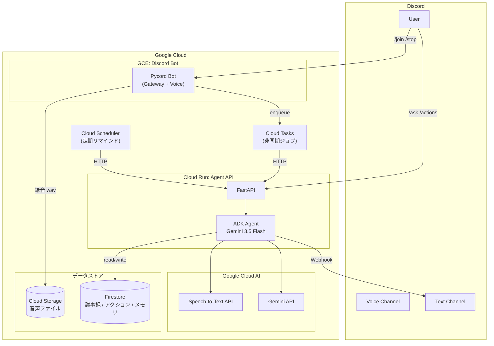
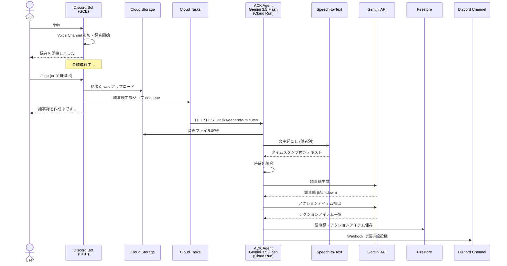
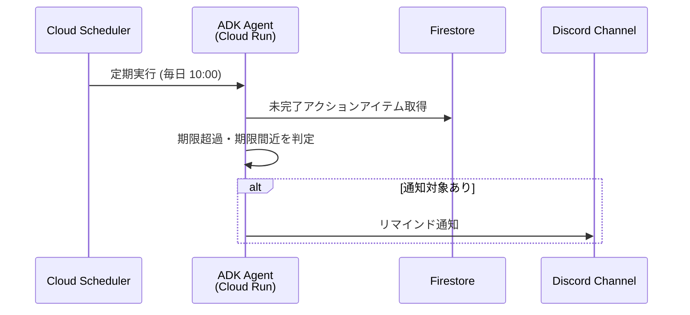
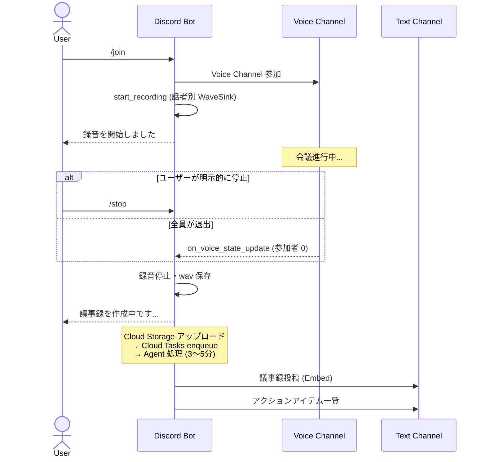
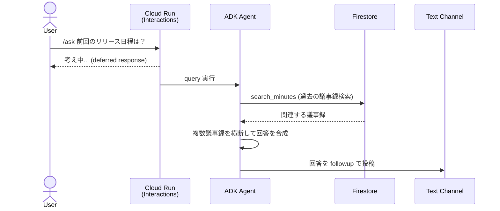
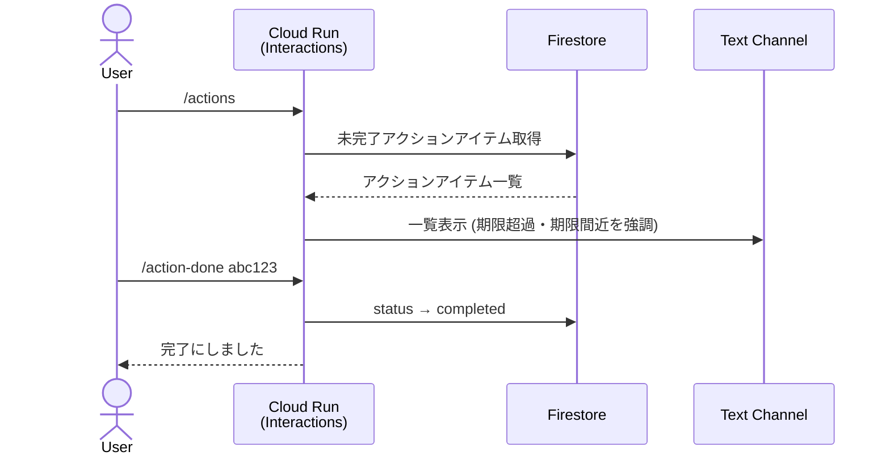
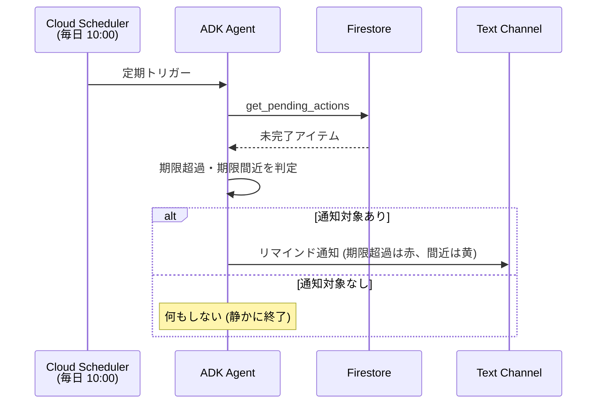

# Minutes Agent — Design Document

## 1. Overview

Discord の定例ミーティングにおける **会議のアカウンタビリティ（説明責任・実行責任）** を自律的に管理する AI エージェント。

Bot が自ら voice channel に参加して録音し、文字起こし→議事録生成→アクションアイテム抽出→Discord 投稿までを全自動で行う。さらに、会議と会議の間（between-meetings）でアクションアイテムの追跡・リマインド・過去議事録の横断検索を自律的に実行する。

**ハッカソン**: [DevOps × AI Agent Hackathon](https://findy.co.jp/4127/) (Findy × Google Cloud)
**提出期限**: 2026-07-10

## 2. Problem Statement

### 表面的な課題: 議事録作成の手間

小規模チームの週次 Discord ミーティングで、議事録作成に毎回 15〜20 分かかる。録音→文字起こし→整形→共有のフローが手動。

### 本質的な課題: 会議のアカウンタビリティ

議事録が作成されても、**決めたことが実行されない**。

- 「前回何を決めたか」が曖昧なまま次の会議が始まる
- アクションアイテムの担当者・期限が形骸化する
- 同じ議題が何度も蒸し返され、結論が出ない
- テキスト参加者の発言が議事録から漏れる

**Minutes Agent はこの「決めたことが実行されない」問題を、AI エージェントの自律的な追跡・通知で解決する。**

### 既存アプローチの限界

Phase 1 として、Craig (録音 Bot) + Whisper (ローカル文字起こし) + Claude Code CLI (議事録生成) のパイプラインを構築し、コマンド 1 発で議事録を生成できるようにした（[Zenn 記事](https://zenn.dev/hinapupil/articles/discord-whisper-meeting-minutes)）。

しかし以下の限界がある:

- Craig の zip を**手動でダウンロード**する必要がある
- ローカル GPU (RTX 3060 等) が必要で**環境依存**
- 議事録生成は 1 回のパイプライン実行で完結し、**文脈の蓄積がない**
- アクションアイテムの追跡・リマインドは**人間任せ**

## 3. Target Users

- **小規模チーム (3〜10 人)** で Discord ミーティングをしている
- 週次〜隔週の定例会議がある
- 議事録は作りたいが、作成・管理のコストを下げたい
- 特別なツール導入なく、Discord だけで完結させたい

## 4. Architecture

### システム全体



### 議事録生成フロー



### Between-Meetings 自律動作



### なぜこの構成か

| 決定 | 理由 |
|------|------|
| GCE で Bot | Voice channel 参加に UDP が必要。Cloud Run は TCP/HTTP のみ |
| Cloud Run で Agent API | AI 処理はリクエスト駆動。サーバーレスでスケーラブル。提出要件の「デプロイ済み URL」にもなる |
| Cloud Tasks で中継 | 議事録生成は数分かかる。Bot → Agent の非同期実行を信頼性高く実現 |
| Firestore | ADK の Session/Memory 統合がビルトイン。議事録・アクションアイテムも同一 DB で管理 |
| Cloud Scheduler | between-meetings のリマインド通知。エージェントの「自律的な行動」を定期実行で実現 |

## 5. Components

### 5.1 Discord Bot (GCE)

**技術**: Pycord v2.8.0 (`py-cord[voice]`)

Pycord を選定した理由:
- `start_recording()` → `WaveSink` で話者ごとに自動分離（Craig 相当の機能が数行で実現）
- ADK と同じ Python で言語統一
- Production/Stable、アクティブメンテナンス (2026-05 時点 v2.8.0)

**責務**:
- Discord Gateway 接続の維持
- Voice channel 参加・録音・退出
- Slash Command の受信と Agent API への転送
- 録音完了時に Cloud Tasks へ enqueue

**Voice Recording フロー**:
```python
@bot.slash_command()
async def join(ctx):
    vc = await ctx.author.voice.channel.connect()
    vc.start_recording(
        discord.sinks.WaveSink(),
        on_recording_finished,
        ctx.channel,
    )
    await ctx.respond("録音を開始しました")

async def on_recording_finished(sink, channel):
    for user_id, audio in sink.audio_data.items():
        # Cloud Storage にアップロード
        blob = bucket.blob(f"{meeting_id}/{user_id}.wav")
        blob.upload_from_file(audio.file)
    # Cloud Tasks に議事録生成ジョブを enqueue
    enqueue_minutes_task(meeting_id, channel.id)
```

### 5.2 Agent API (Cloud Run)

**技術**: FastAPI + ADK

Cloud Run 上で動く HTTP API。Bot からの非同期ジョブ受信と、Discord Interactions (対話コマンド) の両方を処理する。

**エンドポイント**:

| Method | Path | 用途 |
|--------|------|------|
| POST | `/tasks/generate-minutes` | 議事録生成（Cloud Tasks から呼び出し） |
| POST | `/tasks/check-actions` | アクションアイテム期限チェック（Cloud Scheduler から） |
| POST | `/interactions` | Discord Interactions Endpoint（/ask, /actions の応答） |
| GET | `/health` | ヘルスチェック |

**なぜ Interactions Endpoint も併用するか**:
- `/ask` `/actions` は voice 不要 → Cloud Run で直接応答可能
- GCE Bot が落ちていても対話コマンドは動く（可用性向上）
- 「デプロイ済み URL」として審査で動作確認可能

### 5.3 ADK Agent

```python
from google.adk import Agent
from google.adk.apps import App
from google.adk.integrations.firestore import (
    FirestoreSessionService,
    FirestoreMemoryService,
)

root_agent = Agent(
    model="gemini-3.5-flash",
    name="minutes_agent",
    instruction="""
    あなたは会議のアカウンタビリティ・エージェントです。
    会議の継続性と実行責任を管理します。

    ## 責務
    1. 録音された音声を文字起こしし、構造化された議事録を生成する
    2. 議事録からアクションアイテムを自動抽出する
    3. 過去の議事録に関する質問に、複数回を横断して回答する
    4. 未完了のアクションアイテムを追跡し、リマインドする
    5. 繰り返し議論される未解決課題を検出する

    ## 自律判断
    - 前回の議事録を参照し、今回の議題との関連を自動判定
    - アクションアイテムの進捗を過去の議事録から推測
    - 3回以上議論されて未解決の課題は明示的に指摘
    """,
    tools=[
        transcribe_audio,
        generate_minutes,
        extract_action_items,
        search_minutes,
        get_pending_actions,
        send_discord_message,
    ],
)

app = App(name="minutes-agent", root_agent=root_agent)
```

### 5.4 Tools

| ツール | 使用 API | 入力 | 出力 |
|--------|----------|------|------|
| `transcribe_audio` | Speech-to-Text API | GCS URI, 話者名 | タイムスタンプ付きテキスト |
| `generate_minutes` | Gemini API | トランスクリプト, 日付, コンテキスト | 議事録 (Markdown) |
| `extract_action_items` | Gemini API | 議事録テキスト | アクションアイテムのリスト |
| `search_minutes` | Firestore | 検索クエリ | 関連する過去の議事録 |
| `get_pending_actions` | Firestore | なし | 未完了アクションアイテム一覧 |
| `send_discord_message` | Discord Webhook | チャンネル ID, コンテンツ | 送信結果 |

### 5.5 Data Store (Firestore)

```
minutes-agent (database)
├── meetings/
│   └── {meeting_id}/
│       ├── date: timestamp
│       ├── channel_id: string
│       ├── guild_id: string
│       ├── participants: [string]
│       ├── transcript: string
│       ├── minutes_md: string
│       ├── audio_uris: [string]  # GCS URIs
│       ├── status: "recording" | "transcribing" | "generating" | "completed" | "error"
│       └── created_at: timestamp
│
├── action_items/
│   └── {action_id}/
│       ├── meeting_id: string
│       ├── title: string
│       ├── description: string
│       ├── assignee: string          # Discord username
│       ├── assignee_id: string       # Discord user ID
│       ├── due_date: timestamp | null
│       ├── status: "open" | "in_progress" | "completed"
│       ├── created_at: timestamp
│       └── completed_at: timestamp | null
│
└── adk-session/                       # ADK built-in (自動管理)
    └── ...
```

## 6. User Flows

### 6.1 Recording & Minutes Generation (全自動)



### 6.2 Ask (対話検索)



### 6.3 Action Items



### 6.4 Between-Meetings: 自律リマインド



## 7. Slash Commands

| コマンド | 引数 | 処理場所 | 説明 |
|----------|------|----------|------|
| `/join` | なし | GCE Bot | voice channel に参加し録音開始 |
| `/stop` | なし | GCE Bot | 録音停止、議事録生成を開始 |
| `/minutes` | `file: Attachment` | Cloud Run | zip/音声ファイルから議事録生成（手動フォールバック） |
| `/ask` | `question: string` | Cloud Run | 過去の議事録に関する質問 |
| `/actions` | `status?: string` | Cloud Run | アクションアイテム一覧 |
| `/action-done` | `id: string` | Cloud Run | アクションアイテムを完了にする |

## 8. Tech Stack

| カテゴリ | 技術 | 用途 |
|----------|------|------|
| **AI / ML** | Gemini 3.5 Flash | 議事録生成、アクションアイテム抽出、対話応答 |
| | Speech-to-Text API (V2) | 音声の文字起こし（話者分離対応） |
| | ADK (Agent Development Kit) | エージェントオーケストレーション |
| **Compute** | Cloud Run | Agent API (サーバーレス) |
| | GCE (e2-small) | Discord Bot (常時起動) |
| **Data** | Firestore | 議事録、アクションアイテム、ADK セッション/メモリ |
| | Cloud Storage | 音声ファイル保管 |
| **Async** | Cloud Tasks | 非同期ジョブキュー |
| | Cloud Scheduler | 定期実行（リマインド通知） |
| **Discord** | Pycord v2.8+ | Bot フレームワーク (voice recording 対応) |
| **Web** | FastAPI | Agent API サーバー |
| **IaC** | Terraform | GCP リソース管理 |
| **CI/CD** | GitHub Actions | ビルド、テスト、Cloud Run デプロイ |
| **Language** | Python 3.12 | 全コンポーネント統一 |

## 9. Project Structure

```
minutes-agent/
├── agent/                        # ADK Agent
│   ├── __init__.py
│   ├── agent.py                  # root_agent 定義
│   ├── app.py                    # ADK App 定義
│   └── tools/
│       ├── __init__.py
│       ├── transcribe.py         # Speech-to-Text
│       ├── minutes.py            # 議事録生成 (Gemini)
│       ├── actions.py            # アクションアイテム抽出 (Gemini)
│       ├── search.py             # Firestore 検索
│       └── discord_notify.py     # Discord Webhook 通知
├── bot/                          # Discord Bot
│   ├── __init__.py
│   ├── main.py                   # Bot 起動
│   ├── commands/
│   │   ├── __init__.py
│   │   ├── recording.py          # /join, /stop
│   │   ├── ask.py                # /ask
│   │   └── actions.py            # /actions, /action-done
│   └── listeners/
│       ├── __init__.py
│       └── voice_state.py        # 全員退出検知
├── api/                          # Cloud Run API
│   ├── __init__.py
│   ├── main.py                   # FastAPI app
│   ├── tasks.py                  # Cloud Tasks ハンドラ
│   └── interactions.py           # Discord Interactions Endpoint
├── infra/                        # Terraform
│   ├── main.tf
│   ├── variables.tf
│   ├── outputs.tf
│   ├── cloud_run.tf
│   ├── gce.tf
│   ├── firestore.tf
│   ├── storage.tf
│   ├── cloud_tasks.tf
│   ├── scheduler.tf
│   └── iam.tf
├── .github/
│   └── workflows/
│       ├── ci.yml                # lint, test
│       └── deploy.yml            # Cloud Run デプロイ
├── Dockerfile                    # Cloud Run 用
├── Dockerfile.bot                # GCE Bot 用
├── pyproject.toml
├── requirements.txt
├── .gitignore
├── .env.example
└── README.md
```

## 10. Infrastructure (Terraform)

### GCP リソース一覧

| リソース | Terraform resource | 用途 |
|----------|-------------------|------|
| Cloud Run service | `google_cloud_run_v2_service` | Agent API |
| GCE instance | `google_compute_instance` | Discord Bot |
| Cloud Storage bucket | `google_storage_bucket` | 音声ファイル |
| Firestore database | `google_firestore_database` | データストア |
| Cloud Tasks queue | `google_cloud_tasks_queue` | 非同期ジョブ |
| Cloud Scheduler job | `google_cloud_scheduler_job` | リマインド通知 |
| Service Account | `google_service_account` | Bot / Agent 用 |
| IAM bindings | `google_project_iam_member` | 権限設定 |
| Artifact Registry | `google_artifact_registry_repository` | Docker イメージ |

### 見積もりコスト (月額)

| リソース | スペック | 月額目安 |
|----------|---------|---------|
| GCE e2-small | 常時起動 | ~$13 |
| Cloud Run | 週1-2回の議事録生成 | ~$1 (ほぼ無料枠) |
| Speech-to-Text | 週1時間程度 | ~$1.44 |
| Gemini API | 週数回の呼び出し | ~$2 |
| Firestore | 読み書き少量 | 無料枠内 |
| Cloud Storage | 数GB | 無料枠内 |
| **合計** | | **~$18/月** |

## 11. CI/CD (GitHub Actions)

### ci.yml
- `on: push / pull_request`
- ruff (lint) + mypy (type check)
- pytest (unit test)

### deploy.yml
- `on: push to main`
- Docker build → Artifact Registry push
- `gcloud run deploy` (Agent API)
- GCE インスタンスへの SSH deploy (Bot)

## 12. Hackathon Deliverables

| 提出物 | 内容 | 期限 |
|--------|------|------|
| **GitHub リポジトリ** (公開) | このリポジトリ | 7/10 |
| **デプロイ済み URL** | Cloud Run Agent API | 7/10 (7/17 まで維持) |
| **Proto Pedia 登録** | 下記参照 | 7/10 |
| **作品提出フォーム** | Google Form | 7/10 |

### Proto Pedia 登録内容

| 項目 | 内容 |
|------|------|
| タイトル | Minutes Agent — Discord 会議アカウンタビリティ・エージェント |
| 概要 | Discord の定例ミーティングを自動録音し、議事録生成・アクションアイテム追跡を自律的に行う AI エージェント |
| 動画 | YouTube にデモ動画をアップロード (2〜3分) |
| システム構成 | アーキテクチャ図 (本ドキュメント Section 4) |
| タグ | `findy_hackathon` (必須) |
| ストーリー | Section 2 (Problem Statement) + Section 3 (Target Users) |

### デモ動画の構成 (2〜3分)

1. **課題提示** (20秒): 手動議事録の面倒さ、決めたことが実行されない問題
2. **デモ: 録音→議事録** (60秒): `/join` → 会議 → `/stop` → 議事録自動投稿
3. **デモ: 対話検索** (30秒): `/ask` で過去の議事録を検索
4. **デモ: アクションアイテム** (30秒): `/actions` + 自律リマインド
5. **アーキテクチャ** (20秒): Google Cloud 構成の概要

## 13. Schedule (2 weeks, 2-person team)

> インフラ担当の GCP プロジェクト初期セットアップ手順は [Runbook: GCP インフラ ブートストラップ](runbooks/gcp-bootstrap.md) を参照。Architecture Decision Record は [docs/adr/](adr/) を参照。

### Week 1: Core Pipeline

| 日程 | インフラ担当 | アプリ担当 |
|------|------------|-----------|
| **6/27 (金)** | GCP プロジェクト設定、Terraform 初期化、Artifact Registry | リポジトリ構造、pyproject.toml、Pycord Bot 骨格 |
| **6/28 (土)** | GCE 構築、Cloud Storage/Firestore 設定 | Voice recording PoC、Cloud Storage アップロード |
| **6/29 (日)** | Cloud Run デプロイ、Cloud Tasks 設定 | FastAPI 骨格、Speech-to-Text ツール実装 |
| **6/30 (月)** | IAM 権限整備、Bot ↔ Agent API 疎通 | Gemini 議事録生成ツール、アクションアイテム抽出ツール |
| **7/1 (火)** | CI/CD (GitHub Actions)、デプロイ自動化 | 録音→議事録の E2E フロー完成 |

### Week 2: Agent Intelligence + Polish

| 日程 | インフラ担当 | アプリ担当 |
|------|------------|-----------|
| **7/2 (水)** | Cloud Scheduler 設定、リマインド通知 | ADK Agent 定義、instruction チューニング |
| **7/3 (木)** | Interactions Endpoint 設定 (Discord) | `/ask` 対話検索、Firestore Memory 統合 |
| **7/4 (金)** | セキュリティ (Secret Manager、IAM 最小権限) | `/actions` `/action-done` コマンド |
| **7/5 (土)** | 負荷テスト、エラーハンドリング | between-meetings 自律動作、instruction 最終調整 |
| **7/6 (日)** | Terraform 整理、ドキュメント | 統合テスト、バグ修正 |
| **7/7 (月)** | アーキテクチャ図清書 | デモ動画撮影 |
| **7/8 (火)** | Proto Pedia 登録 | デモ動画編集・アップロード |
| **7/9 (水)** | 最終テスト、デプロイ確認 | 作品提出フォーム記入 |
| **7/10 (木)** | **提出** | **提出** |

### 7/10 以降

- デプロイ済み環境を **7/17 まで維持**（一次審査期間）
- 二次審査 (7/21-7/24) まで維持が望ましい

## 14. Risks & Mitigations

| リスク | 影響 | 緩和策 |
|--------|------|--------|
| Pycord voice recording が不安定 | 録音失敗 | `/minutes [zip]` の手動フォールバック。デモは安定環境で実施 |
| Speech-to-Text の日本語精度 | 議事録品質低下 | Whisper のハルシネーション対策ノウハウ (VAD + パターンフィルタ) を応用。モデル選択を V2 chirp_2 に |
| Cloud Run の cold start | `/ask` の応答遅延 | min-instances=1 で常時ウォーム。初回応答は「考え中...」表示 |
| GCE Bot の可用性 | 録音不可 | systemd で自動再起動。Cloud Monitoring でアラート |
| 2週間のスケジュール超過 | 機能不足 | MVP (録音→議事録→投稿) を Week 1 で完成。Week 2 の機能は優先度順にカット可能 |
| GCP コスト超過 | 予算超過 | バジェットアラート設定。審査後にリソース縮小 |
| デモ動画の品質 | 審査での印象低下 | 7/7-8 の 2日間を確保。スクリプトを事前に用意 |

## 15. Scoring Strategy (審査基準対応)

### 1. AIエージェントが価値の中心になっているか

**打ち出し**: 単なるパイプラインではなく、会議の継続性を自律管理するエージェント。

- ADK Agent が **状況に応じてツールを自律選択**（パイプライン = 固定順序との対比）
- **between-meetings の能動アクション**: リマインド通知、未解決課題検出
- **記憶の蓄積**: Firestore Memory で過去の議事録を横断的に参照
- **「エージェントを外したらパイプラインに退化する」** = 必然性の証明

### 2. 設定した課題へのアプローチ力

- **実体験ベース**: Zenn 記事で Phase 1 を公開済み → Phase 2 への進化
- **課題のリフレーム**: 「議事録が面倒」(表面) → 「決めたことが実行されない」(本質)
- **ストーリーの一貫性**: 手動 → コマンド1発 → 完全自動+自律追跡

### 3. ユーザビリティ

- Discord で完結。新しいアプリ不要
- `/join` → 録音、あとは全自動
- `/ask` で自然言語で質問

### 4. 実用性・体験価値

- Phase 1 で実運用済み（Zenn 記事がエビデンス）
- 週次ミーティングですぐ使える実用性
- 「会議が終わったら議事録ができている」体験

### 5. 実装力

- GCE + Cloud Run のハイブリッド（責務分離）
- Cloud Tasks による非同期処理（実運用パターン）
- Terraform で IaC
- GitHub Actions で CI/CD
- Google Cloud AI 技術を 3 つ活用 (Speech-to-Text, Gemini API, ADK)
